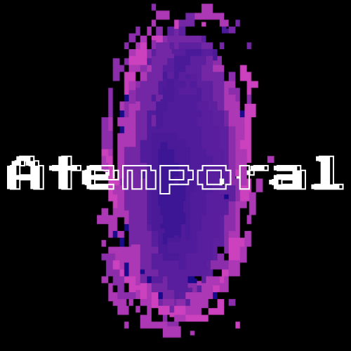
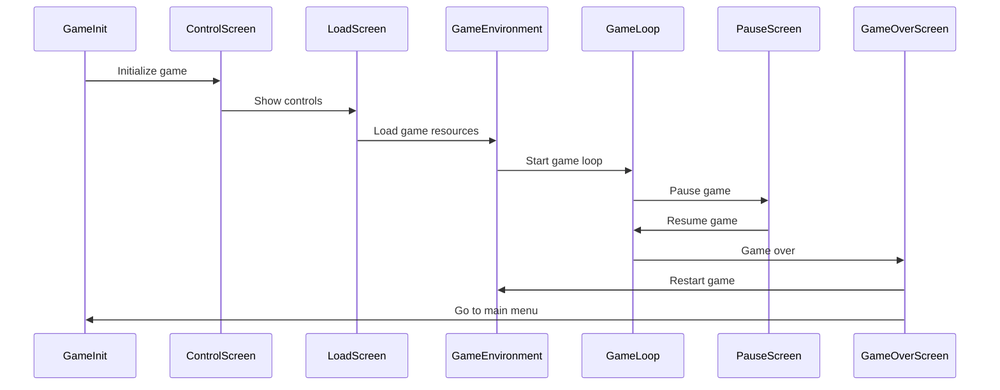

### Contents / Conteúdos

- [English](#english)
- [Português](#português)

 

>  English

 

<h1 align="center">
  
  
Learn from the past, do it in the present and change the future.</h3>
</h1>

 

<h1 style="color:#00BCD4">Game Project: <strong>Atemporal</strong></h1>

  
<strong>Language:</strong> Java 8 (Corretto 1.8) 
  <strong>Framework:</strong> JavaFX and Java X 
  <strong>Agile Framework:</strong> Scrum

 

## 🧭 Presentation

<strong style="color:#00BCD4;">Atemporal</strong> is a 2D Beat 'em up style game inspired by **Soul Knight** and **Streets of Rage**. The goal of this project is to utilize the <strong style="color:#FF5722;">SCRUM</strong> methodology and deepen our knowledge of object-oriented programming (OOP).

<table>
  <tr>
      <td align="center">
         
        
          <b>Soul Knight</b>
        
         
        Android / iOS
      </a>
    </td>
    <td align="center">
         
        
          <b>Streets of Rage 4</b>
        
         
        PC / PS4 / Xbox One / Mobile
      </a>
    </td>
  <tr>
<table>

## 📖 Prologue

Players can have immersive experiences through temporal rifts, exploring different historical periods of humanity. In the Middle Ages, help Sir Dante eliminate skeletal threats and end the reign of the dark lord Malakar. End a world war in the Contemporary Era as a special forces soldier, or perhaps, in the chaotic future of 2099, help B.M.O. to stop Cybernet and bring an end to this <strong style="color:#00BCD4;">ATEMPORAL</strong> chaos.

## 🕹️ Gameplay

In game, similar to **Streets of Rage**, enemies will appear from the right side of the screen. Players can move and attack them using the unique abilities of each class. Each distinct map features its own set of enemies and a unique boss at the end of each level, providing a challenging and engaging experience.

<table>
  <tr>
      <td align="center">
         
        
          <b>Teenage Mutant Ninja Turtles: Shredder's Revenge</b>
        
         
        (2022)
      </a>
    </td>
    <td align="center">
         
        
          <b>Streets of Rage 4</b>
        
         
        (2020)
      </a>
    </td>
  <tr>
<table>

## 💻 Technologies

## 💡 Concept

**[🎨 Figma Prototype](https://www.figma.com/design/NGgqwBoLR8VmkY2Npwnrld/Prot%C3%B3tipo?node-id=0-1&t=d9A0FylNrJmmIOvL-1)**

**[📌 Game Concept in Figma](https://www.figma.com/board/ySHEMOjnEVKOhBahRAtJEl/Projeto-Jogo-em-Java?node-id=0-1&t=pyLgSd3ro10QEjmo-1)**

## 🎯 Class Diagram

``` mermaid

classDiagram
    direction LR
    class Application {
        +start(Stage primaryStage)
    }

    class Boss {
        -double life
        -Image[] boss_atk_ragemode
        -Image[] boss_idle_ragemode
        -Timeline atkrage
        -Timeline idlerage
        -int indexAtk
        -int indexIdle
        +Boss(double x, double y)
        -loadimages()
        -setupAnimations()
        +boolean boss_ready_to_atk(Player player)
        +void bossatk()
        +void movement(Player player)
        +double getLife()
        +Timeline getAtkrage()
        +Timeline getIdlerage()
    }

    Boss --> Enemy : extends

    class ControlScreen {
        +start(Stage primaryStage)
        -setupKeyHandlers(Scene scene, Stage primaryStage)
    }

    ControlScreen --> Application : extends

    class Enemy {
        -Image skIdle
        -Image[] skrunRight
        -Image[] skrunLeft
        -Image[] skatk
        -int indexRun
        -int indexAtk
        -Timeline runR
        -Timeline runL
        -Timeline skatkT
        -MapObstacles obstacles
        +Enemy(double x, double y)
        -loadImages()
        -enemy_timelines()
        +void followPlayer(Player player)
        +boolean enemy_collision_hit(Player player)
        +Timeline getskatkT()
        +void setskatkT(Timeline skatkT)
    }

    Enemy --> ImageView : extends

    class GameEnvironment {
        +start(Stage primaryStage)
        +int getSceneWidth()
        +int getSceneHeight()
    }

    GameEnvironment --> Application : extends

    class GameInit {
        +start(Stage primaryStage)
        -showCharacterSelection()
        -VBox createCharacterBox(String imagePath, String characterName)
        -void selectCharacter(String characterName)
        -void openSettings()
    }

    GameInit --> Application : extends

    class GameLoop {
        -Player player
        -Pane pane
        -Enemy[] enemies
        -Boss boss
        -GameEnvironment gameEnvironment
        -SoundsFX sound
        -AnimationTimer animationTimer
        -MapObstacles[] obstacles
        -Random Xr
        -Random Yr 
        -Random rr
        -boolean flag_enemy
        -int enemylife
        -int playerlife
        -int flag_cycle
        -int kill
        +GameLoop(Scene scene, Player player, Pane pane, Stage primaryStage)
        -void setupAnimationTimer(Stage primaryStage)
        -void spawnEnemy()
        -void spawnBoss()
        -void setObstacles()
        -void setupKeyHandlers(Scene scene, Stage primaryStage)
        -void handleMovement(KeyCode code, Stage primaryStage)
        -void kill_enemy(int index)
        +void start()
    }

    class GameMap {
        -ImageView backgroundImageView
        +GameMap(double width, double height)
        +ImageView getBackgroundImageView()
    }

    class GameOverScreen {
        +start(Stage primaryStage)
        -void gameLoop(Stage primaryStage)
        -void backToMenu(Stage primaryStage)
    }

    GameOverScreen --> Application : extends

    class LoadingScreen {
        -Image portalImage
        +LoadingScreen()
        +start(Stage primaryStage)
        -void setupKeyHandlers(Scene scene, Stage primaryStage)
    }

    LoadingScreen --> Application : extends

    class MapObstacles {
        -ImageView[] map_obj
        +MapObstacles(double x, double y, int n)
        +MapObstacles()
        -void load_map_images()
        +double gettX(int n)
        +double gettY(int n)
        +double gettFitWidth(int n)
        +double gettFitHeight(int n)
        +void setX(int x, int n)
        +Node getMap_obj(int n)
        +void setMap_obj(ImageView[] map_obj)
    }

    MapObstacles --> ImageView : extends

    class Menu {
        +start(Stage primaryStage)
        -void openSettings()
        -void startGame(Stage primaryStage)
    }

    Menu --> Application : extends

    class PauseScreen {
        +start(Stage primaryStage)
        -void game_Loop(Stage primaryStage)
        -void backMenu(Stage primaryStage)
    }

    PauseScreen --> Application : extends

    class Player {
        -final double PLAYER_HEIGHT
        -final double PLAYER_WIDTH
        -static final double WIDTH
        -static final double HEIGHT
        -double speed
        -MapObstacles[] obstacles
        -ImageView imageView
        -Image[] runRight
        -Image[] runLeft
        -Image[] knatk
        -Image[] kndead
        -Image idle
        -int indexRun
        -int indexAtk
        -int indexDead
        -Timeline runR
        -Timeline runL
        -Timeline atk
        -Timeline kndead
        +Player(double startX, double startY)
        -void loadImages()
        -void setupAnimations()
        +ImageView getImageView()
        +void setupObstacles()
        +boolean player_rock_collision_q0()
        +boolean player_rock_collision_q1()
        +boolean player_rock_collision_q2()
        +boolean player_alt_collision_q0()
        +boolean player_alt_collision_q1()
        +boolean player_alt_collision_q2()
        +boolean player_rock_collision_p0()
        +boolean player_rock_collision_p1()
        +boolean player_rock_collision_p2()
        +boolean player_alt_collision_p0()
        +boolean player_collisionXleft()
        +boolean player_collisionXright()
        +boolean player_collisionYup()
        +boolean player_collisionYdown()
        +boolean player_enemy_collision(Enemy enemy)
        +void moveLeft()
        +void moveRight()
        +void moveUp()
        +void moveDown()
        +void stopAnimation()
        +void setSpeed(double speed)
        +double getWidth()
        +double getHeight()
        +Timeline getAtk()
        +Timeline getDead()
        +void setX(int x)
        +void setY(int y)
    }

    Player --> ImageView : extends

    class SoundsFX {
        +void play()
    }

```

## ⏩ Sequence Diagram

## 🤝 Collaborators

The following people contributed to this project being carried out:

<table>
  <tr>
      <td align="center">
      <a href="https://github.com/KauanIzidoro" title="Github">
         
        
          <b>Kauan</b>
        
        </a>
         
        Development and Game Designer
    </td>
    <td align="center">
      <a href="https://github.com/gmgpx" title="Github">
         
        
          <b>Gustavo</b>
        
        </a>
         
        Development and UI/UX Designer
    </td>
    <td align="center">
      <a href="https://github.com/05samuk" title="Github">
         
        
          <b>Samuel</b>
        
        </a>
         
        Development and Sound Engineer
    </td>
    <td align="center">
      <a href="https://github.com/JJuanPablo" title="Github">
         
        
          <b>Juan</b>
        
        </a>
         
        Development and Character Designer
    </td>
  </tr>
</table>

 

>  Português

 

<h1 align="center">
  
  
Aprenda com o passado, faça no presente e mude o futuro.</h3>
</h1>

 

<h1 style="color:#00BCD4">Projeto de Jogo: <strong>Atemporal</strong></h1>

  
<strong>Linguagem:</strong> Java 8 (Corretto 1.8) 
  <strong>Framework:</strong> JavaFX e Java X 
  <strong>Metodologia Ágil:</strong> Scrum

 

## 🧭 Apresentação

<strong style="color:#00BCD4;">Atemporal</strong> é um jogo estilo *Beat 'em up* 2D inspirado em **Soul Knight** e **Streets of Rage**. O objetivo deste projeto é utilizar a metodologia<strong style="color:#FF5722;"> SCRUM</strong> e aprofundar nossos conhecimentos em programação orientada a objetos (POO).

<table>
  <tr>
      <td align="center">
         
        
          <b>Soul Knight</b>
        
         
        Android / iOS
    </td>
    <td align="center">
         
        
          <b>Streets of Rage 4</b>
        
         
        
        PC / PS4 / Xbox One / Mobile
        
    </td>
  </tr>
</table>

## 📖 Prólogo

Os jogadores podem ter experiências imersivas através de fendas temporais, explorando diferentes períodos históricos da humanidade. Na Idade Média, ajude Sir Dante a eliminar ameaças esqueléticas e acabar com o reinado do senhor das trevas, Malakar. Termine uma guerra mundial na Era Contemporânea como um soldado das forças especiais, ou talvez, no futuro caótico de 2099, ajude B.M.O. a parar a Cybernet e acabar com esse caos <strong style="color:#00BCD4;">ATEMPORAL</strong>.

## 🕹️ Jogabilidade

No jogo, semelhante a **Streets of Rage**, os inimigos aparecerão do lado direito da tela. Os jogadores podem se mover e atacá-los usando as habilidades únicas de cada classe. Cada mapa distinto apresenta seu próprio conjunto de inimigos e um chefe único no final de cada nível, proporcionando uma experiência desafiadora e envolvente.

<table>
  <tr>
      <td align="center">
         
        
          <b>Teenage Mutant Ninja Turtles: Shredder's Revenge</b>
        
         
        (2022)
    </td>
    <td align="center">
         
        
          <b>Streets of Rage 4</b>
        
         
        (2020)
    </td>
  </tr>
</table>

## 💻 Tecnologias

## 💡 Conceito

**[🎨 Protótipo no Figma](https://www.figma.com/design/NGgqwBoLR8VmkY2Npwnrld/Prot%C3%B3tipo?node-id=0-1&t=d9A0FylNrJmmIOvL-1)**

**[📌 Conceito do Jogo no Figma](https://www.figma.com/board/ySHEMOjnEVKOhBahRAtJEl/Projeto-Jogo-em-Java?node-id=0-1&t=pyLgSd3ro10QEjmo-1)**

## 🎯 Diagrama de Classes

## ⏩ Diagrama de sequência

## 🤝 Colaboradores

As seguintes pessoas contribuíram para a realização deste projeto:

<table>
  <tr>
      <td align="center">
      <a href="https://github.com/KauanIzidoro" title="Github">
         
        
          <b>Kauan</b>
        
      </a>
         
        Desenvolvedor e Game Designer
    </td>
    <td align="center">
      <a href="https://github.com/gmgpx" title="Github">
         
        
          <b>Gustavo</b>
        
      </a>
         
        Desenvolvedor e UI/UX Designer
    </td>
    <td align="center">
      <a href="https://github.com/05samuk" title="Github">
         
        
          <b>Samuel</b>
        
      </a>
         
        Desenvolvedor e Engenheiro de Som
    </td>
    <td align="center">
      <a href="https://github.com/JJuanPablo" title="Github">
         
        
          <b>Juan</b>
        
      </a>
         
        Desenvolvedor e Designer de Personagem
    </td>
  </tr>
</table>
